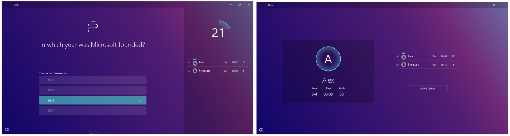

<!---
    category: NetworkingAndWebServices DeepLinksAndAppToAppCommunication
-->

# Remote Systems Session API (Quiz Game UWP Sample)

A pub-style trivia game sample for the Universal Windows Platform (UWP) demonstrating the Remote System Session API (part of the Project Rome platform).

> Note - This sample is targeted and tested for Windows 10, version 2004 (10.0; Build 19041), and Visual Studio 2019. If you prefer, you can use project properties to retarget the project(s) to Windows 10, version 1903 (10.0; Build 18362).

Project Rome is a platform for creating shared experiences that can enable developers to extend their app across devices connected proximally, or through the cloud. The Remote Session API allows a device to host a session that is discoverable by other devices that are nearby. They can then join this session, and send messages among the host and other participants. 

When running the sample, you are presented with an option to create a new game as a quiz session host on your local network, or join an existing game and answer questions from the quiz host. The host sends the questions to the proximal devices, while the participants answer the questions on their own devices. A quiz host can advance the game to additional questions and display the scores at the end. 

> Note - For more information on the Project Rome platform, including the Remote System Session API, see [Connected apps and devices](https://docs.microsoft.com/windows/uwp/launch-resume/connected-apps-and-devices).

## Universal Windows Platform development

### Prerequisites

- Windows 10. Minimum: Windows 10, version 1809 (10.0; Build 17763), also known as the Windows 10 October 2018 Update.
- [Windows 10 SDK](https://developer.microsoft.com/windows/downloads/windows-10-sdk). Minimum: Windows SDK version 10.0.17763.0 (Windows 10, version 1809).
- [Visual Studio 2019](https://visualstudio.microsoft.com/downloads/) (or Visual Studio 2017). You can use the free Visual Studio Community Edition to build and run Windows Universal Platform (UWP) apps.

To get the latest updates to Windows and the development tools, and to help shape their development, join 
the [Windows Insider Program](https://insider.windows.com).

## Running the sample

To run this sample, you'll need to:

- Have at least two Windows 10 devices running the [Windows 10 Fall Creators Update](https://support.microsoft.com/help/4028685/windows-10-get-the-fall-creators-update) (version 16299).

- Configure the following settings:
    1. Bluetooth must be enabled, this can be enabled by going to **Settings | Bluetooth & other devices** and turning on Bluetooth.
    2. Share across devices must also be enabled, you'll need to access **Change shared experience settings**. The feature  **Share across devices** must be set to **On** and **Everyone nearby.**
    3. Ensure the **RemoteSystem**, **Bluetooth**, and **Internet (Client and Server)** capabilities are added in your project. It should be checked by default, but it's important to check this prior to working on any Remote System Session API project.
- Deploy the app to a minimum of two Windows 10 devices. On one device you'll need to become a sessions host/quiz game host and on another device join the session and answer the game questions.

> Note -  Bluetooth must be enabled and the devices that are messaging with each other must be on the same network. Bluetooth is used for discovery of sessions, and the connection then occurs using a network connection e.g. WiFi or Local Area Network (LAN). Discovery will not work over the LAN if you joined to a public network as it will be blocked by the firewall. This applies to both session and device discovery.

## Code at a glance

The Remote System Session API provides the following functionality:
- Create - ability to create a session for participants to join
- Discovery - discover sessions
- Participants - the ability to join a session, leave a session, and invite session devices
- Messaging - broadcast or targeted participant messages

> Note -The Remote System Session API also supports a workflow to invite participants, which is currently not covered in this sample. 

In the sample, the **SessionsHelper.cs** contains the core code for working with the Remote System Session API. From here you'll be able to construct calls to create a session for device participants to attach to. Some key API concepts are:
- **RemoteSystemSession** - A sharing session object with participants. Messages are broadcast to all participants or targeted to a specific participant based upon preference.
- **RemoteSystemSessionWatcher** - A watcher object that is notified about remote sessions that have been added or removed. 
- **RemoteSystemSessionMessageChannel** - The channel is a logical construct on top of RemoteSystemSession. The channel provides the flexibility to create named channels for dedicated data transfer. Channels can be reliable or unreliable. In both cases the ordering of the messages is not guaranteed. 
- **RemoteSystemSessionParticipant** - Represents a participant in a session. A session can have one or more participants.

 
